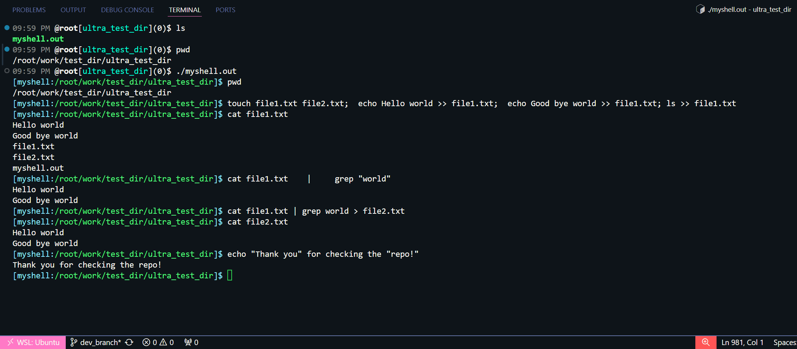
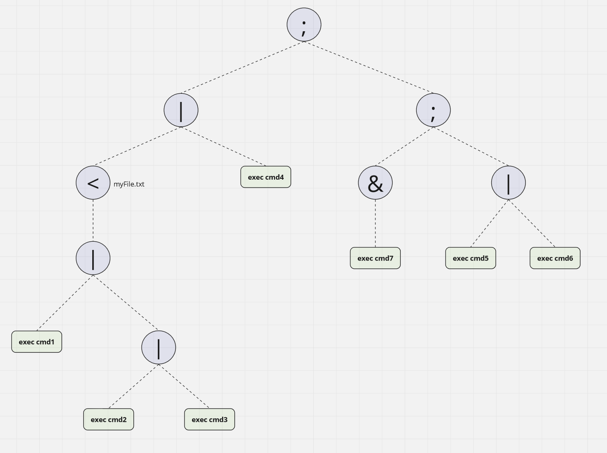
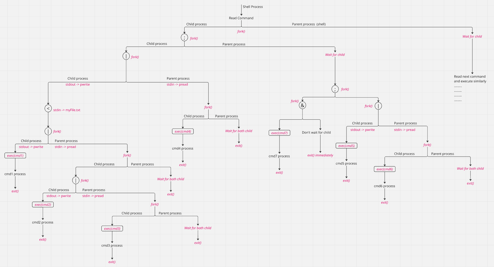

# myshell
- A POSIX shell implementation in C++
- Can parse and execute commands
- Supported shell operators: 
    - Pipe `|`
    - I/O redirection `<`, `>`, `>>`
    - Background `&`
    - Line separator `;`

## Tutorial:
- You can download the `myshell.out` binary and run the shell using `./myshell.out` command.
- Then any command and shell operators can be ran using this shell.
- Example screenshot:
    

## Flow:
- From the given input command, parse tree is built
- Then the parse tree is executed using system calls

    ### Example:
    - Command: `(cmd1 | cmd2 | cmd3) < myFile.txt | cmd4; cmd7 &; cmd5 | cmd6`
    - Parse tree: ` (((((cmd1 )|((cmd2 )|(cmd3 ))) < myFile.txt)|(cmd4 ));(((cmd7 )&);((cmd5 )|(cmd6 ))))`

        

    - Parse tree will be traversed in preorder manner and each operator and exec nodes will be executed accordingly.
    - Flow:
        - `pread`: pipe read end
        - `pwrite`: pipe write end

        

## Files:
| File | Description |
|----------|----------|
| `parsetree/Command.cpp` | Interface for parse tree nodes |
| `parsetree/...rest...` | Implementation of parse tree nodes |
| `test-programs/` | Programs to test the shell operators |
| `util/lexer.cpp` | For getting tokens from input string |
| `util/parser.cpp` | For building parse tree from tokens |
| `util/SystemCallWrapper.cpp` | Adapter class containing wrappers for C sys calls |
| `config.cpp` | For storing the config (for now only storing debug_mode) |
| `main.cpp` | Contains main function |